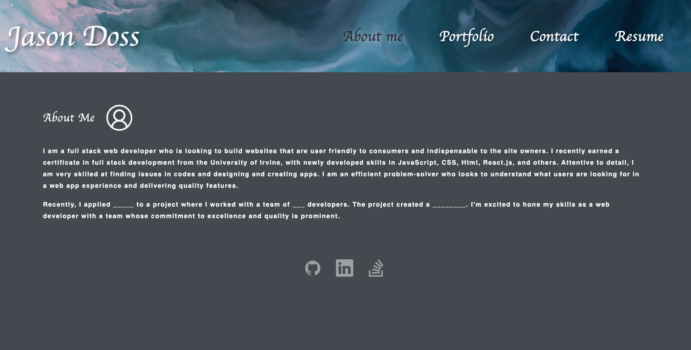
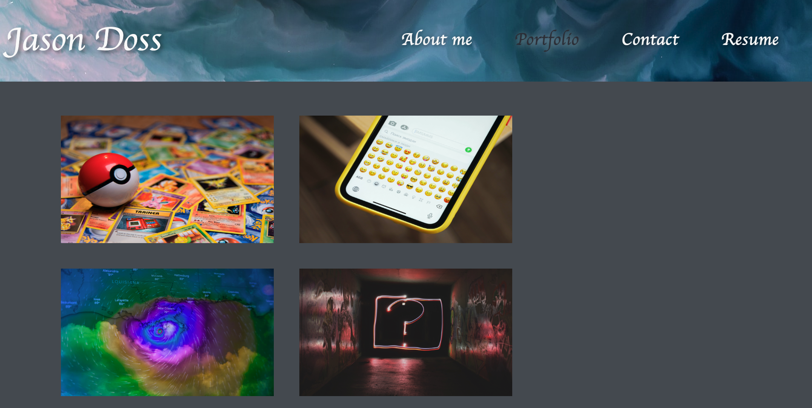
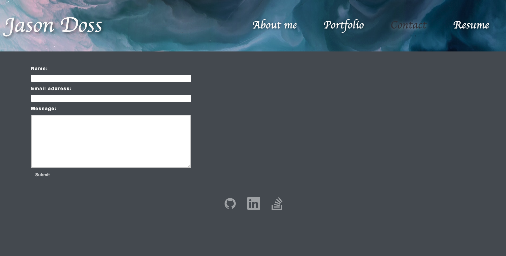
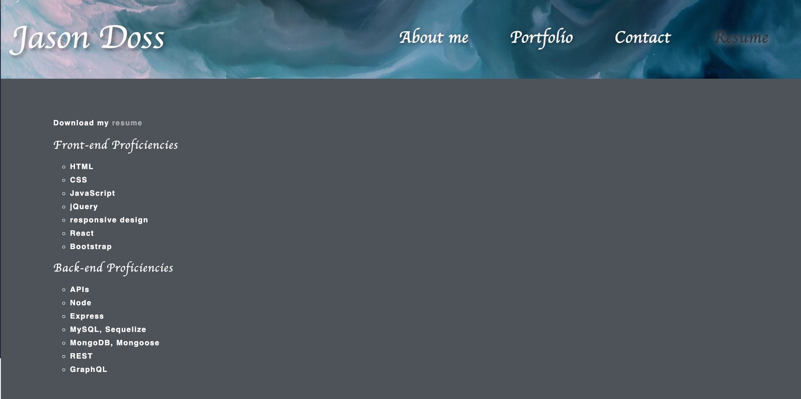

# simply-react
## Description

This is a React application that showcases my projects and skills that I have developed through the Full Stack Flex Boot Camp at University California Irvine. There is an `About me`, `Portfolio`, `Contact Me` and `Resume` links on the top right in the `Header` of the application. In the `Footer` of the application you will see my `GitHub`, `LinkedIn`, and `StackOverflow` links and icons for my profiles. 
## Usage

`Visit`: 

  
  
  
  
  
  
  

   